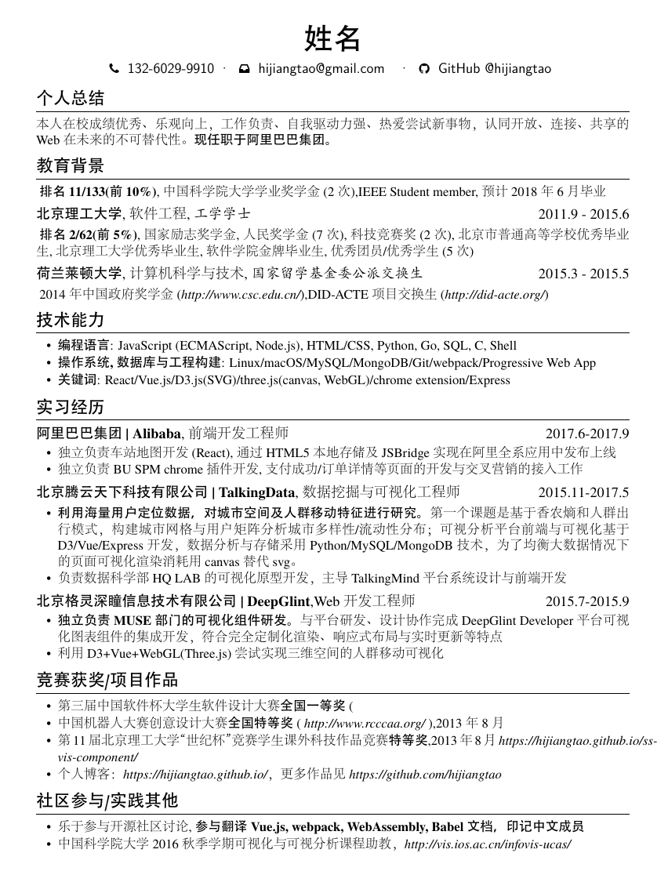

## 介绍
一份简历模板，fork自[hijiangtao/resume](https://github.com/hijiangtao/resume)，自己随意删改了一些东西。

## 使用
- 将整个项目直接上传到overleaf上，使用xelatex编译
- 使用本地的texstudio编译


## 预览




## FontAwesome
`resume-zh_CN.tex` 已经导入了 `fontawesome` 包，但只有 [v4.5](https://fontawesome.com/v4/icons/) 的图标（不支持 `alias` 别名）。在网站中查找想使用的图标，然后在 `fontawesome.sty` 中找到相应的宏, 将其作为普通文本一样使用：
```latex
\faGithub  \; GitHub @hijiangtao
```